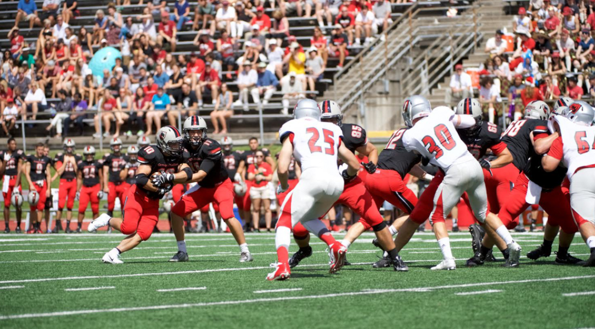

## Applying NFL Statistical Models to CMU Football
Sports Analytics Capstone Project: Our group analyzed & web-scraped DIII football data to model gameplay for the CMU football team. We evaluated defense and offense performance using both a play efficiency and expected points model and created a model for predicting the next scoring event.
- 
- Tags: Research
- Badges:
  - Research [purple]
  - R [cyan]
  - Predictive Modeling [cyan]
  - Web Scraping [cyan]
- Buttons:
  - GitHub [https://github.com/marionhaney/36-493-football]
  - View Poster [../assets/football-capstone-poster.pdf]

## MindfulNest
MindfulNest is a tool for preK classrooms that teaches children emotion regulation techniques using both a tablet app and physical interactive devices. During the 2022-2023 school year, the tool underwent a clinical trial in the Pittsburgh area. I have been cleaning and analyzing data from this trial to assess MindfulNest's effectiveness.
- 
- Tags: Research
- Badges:
  - Research [purple]
  - R [cyan]
  - SQL [cyan]
- Buttons:
  - Project Website [https://mindfulnest.createlab.org]