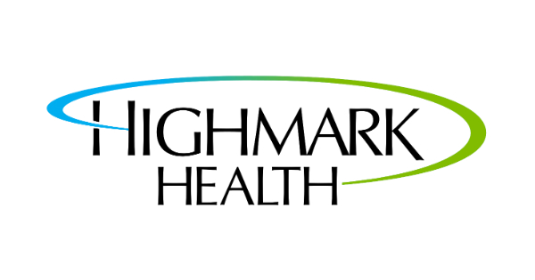

## CREATE Lab
- *Research Assistant* | Aug'22 - Present
- 
- Tags: Data Science
- Badges:
  - Part Time [green]
  - Research [purple]
  - Product Development [pink]
  - R [cyan]
  - SQL [cyan]
- List Items:
  - I am a researcher on the MindfulNest project: a tool for preschool classrooms aimed at teaching children emotion regulation skills.
  - The tool combines a tablet app with several robotic tangible items: the flower, sheep, and magic wand. Children can use MindfulNest on their own to learn about emotions and how to self-regulate when they are feeling a LOT of one emotion!
  - I have been collecting and analyzing data from our 2022-2023 Emotion Regulation study, where we piloted MindfulNest in 10 classrooms in the Pittsburgh area, reaching over 100 students!
  - Currently, we are expanding MindfulNest's reach and continuously improving the tool.
  - Through my work with MindfulNest, I have developed an interest in early childhood education and promoting emotional well-being.

## Gopuff
- *Product Management Intern* | May'22 - Aug'22
- 
- Tags: Product Management
- Badges:
  - Internship [blue]
  - Management [orange]
  - Product Development [pink]
- List Items:
  - During Gopuff's summer internship, I worked on the Partner Integrations team. We focused on the Gopuff x UberEats integration, Gopuff x Grubhub integration, and Shopify platform integration (Powered By Gopuff).
  - I created user stories and usability workflows, product requirements documents, and investigated emerging markets through market research. 
  - I managed and guided a team of engineers daily through Agile workflow.
  - I really enjoyed the fast-paced start-up environment: it was exciting to not only see my work be integral to the team but also experience the rapid deployment of ideas.

## Highmark Health
- *IT Systems Analyst, Data Analytics Intern* | May'21 - Oct'21
- 
- Tags: Data Science
- Badges:
  - Internship [blue]
  - Part Time [green]
  - Tableau [cyan]
- List Items:
  - During Highmark Health's summer internship, I worked on the Service Portfolio Analytics & Request (SPAR) Team. The SPAR team leverages and manages the IT softwares and services for the company. This internship was remote due to the COVID-19 pandemic.
  - I created and managed IT catalogs and financial reports via Tableau dashboards as well as an interactive website for internal company use.

## Language Production & Executive Control Lab
- *Research Assistant* | May'20 - May'21
- 
- Tags: Data Science
- Badges:
  - Part Time [green]
  - JavaScript [cyan]
  - HTML [cyan]
  - SQL [cyan]
  - Python [cyan]
- List Items:
  - In my first academic research experience, I worked with Bonnie Nozari in investigating the typing errors we make and how those mistakes may be influenced by the presence of visual feedback (think of when you type your password and those dots appear).
  - I coded and conducted 3 online experiments for use with the Amazon Mechanical Turk and AWS platforms.
  - This experience was during the COVID-19 pandemic, so it was important for the online experiments to be self-sufficient and understandable for participants.
  - We learned that typing studies worked well in the online experiment format-- it became an easy way to gather large amounts of data quickly.
  - I wrote coding templates and instructional documents for deploying future online experiments using Amazon Mechanical Turk and AWS platforms.
