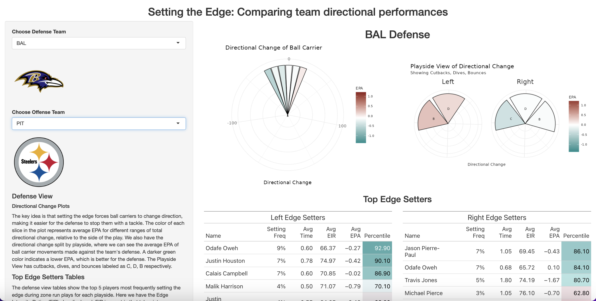

## No Edge No Chance
2024 NFL Big Data Bowl submission: Collaborating with CMU Football Head Coach Ryan Larsen and Defensive Coordinator Ben Gibboney, we proposed a quantitative definition and evaluation metric for the defensive concept of "setting the edge". We made an R Shiny app that gives coaches a team view of edge-setting directional performance.
- 
- Tags: Sports Analytics
- Badges:
  - R [cyan]
  - R Shiny [cyan]
- Buttons:
  - GitHub [https://github.com/hauckshane/BigDataBowl-MADS]
  - Kaggle Notebook [https://tinyurl.com/no-edge-no-chance]
  - Shiny App [https://dkz51f-marion-haney.shinyapps.io/edge-setting-epa/]

## tAIylor's version
Text Analysis Project: We used modern language analysis methods to compare Taylor Swift lyrics from albums included in her Taylor Swift: The Eras Tour. We fine-tuned a large language model to classify which album Taylor Swift lyrics come from. Next, we created tAIylor's version, a fine-tuned GPT-2 model that generates song lyrics in Taylor Swift's style of writing! In doing so, we investigate the questions: Can AI be creative? Will AI be able to replace songwriters?
- 
- Tags: Research
- Badges:
  - R [cyan]
  - Python [cyan]
  - Large Language Models [cyan]
  - Generative AI [cyan]
- Buttons:
  - GitHub [https://github.com/marionhaney/tAIylors-version]

## Applying NFL Statistical Models to CMU Football
Sports Analytics Capstone Project: Our group analyzed & web-scraped DIII football data to model gameplay for the CMU football team. We evaluated defense and offense performance using both a play efficiency and expected points model and created a model for predicting the next scoring event.
- 
- Tags: Sports Analytics
- Badges:
  - R [cyan]
  - Predictive Modeling [cyan]
  - Web Scraping [cyan]
- Buttons:
  - GitHub [https://github.com/marionhaney/36-493-football]
  - View Poster [../assets/football-capstone-poster.pdf]

## Sorting Hat Booth Game
Kappa Alpha Theta 2023 Booth, CMU Spring Carnival: I lead a team to design & develop a game inspired by the Sorting Hat from Harry Potter! The game is a CMU-themed personality test that sorts you into your Harry Potter house. We made a robotic model of the movie Sorting Hat that talks to you and actively "thinks" while you take the personality test.
- 
- Tags: Robotics, Web Apps
- Badges:
  - Project Management [cyan]
  - JavaScript [cyan]
  - Arduino [cyan]
- Buttons:
  - GitHub [https://github.com/marionhaney/sorting-hat]
  - Design Sketch [../assets/original-plans-hat.pdf]

## MindfulNest
MindfulNest is a tool for preschool classrooms that teaches children emotion regulation techniques using both a tablet app and interactive robotic devices.
- 
- Tags: Sports Analytics
- Badges:
  - R [cyan]
  - SQL [cyan]
- Buttons:
  - Project Website [https://mindfulnest.createlab.org]